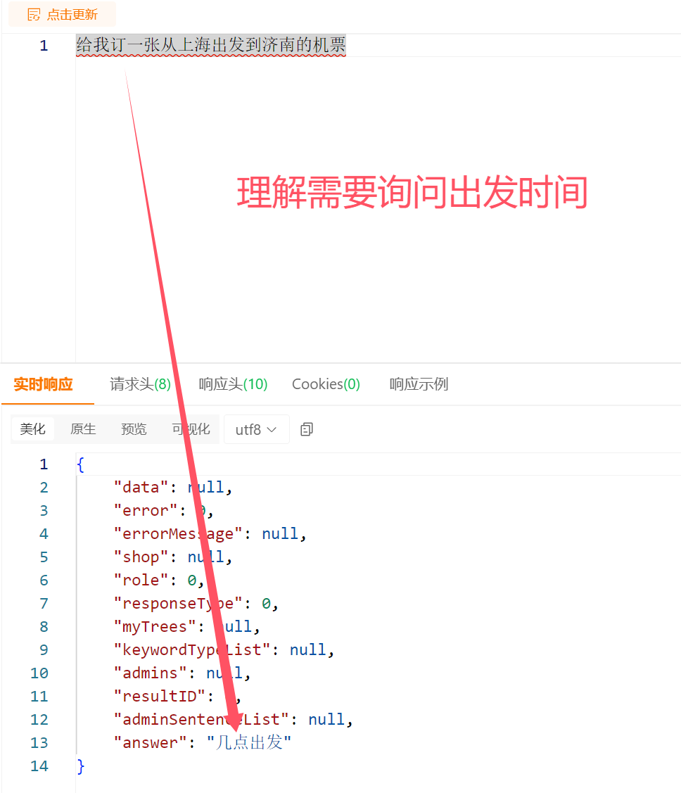

<div align=center> </div>

# 前言
EasyAi对于Java的用处，等同于在JavaWeb领域spring的意义一样——做一个开箱即用，让每一个开发者都可以使用EasyAi，来开发符合自己人工智能业务需求的小微模型，这就是它的使命！

## EasyAi介绍
EasyAi无任何依赖，它是一个原生Java人工智能算法框架。首先，</font><strong face="微软雅黑" color=black size=5>它可以Maven一键丝滑引入我们的Java项目，无需任何额外的环境配置与依赖，做到开箱即用。</strong >再者，它既有一些我们已经封装好的图像目标检测及人工智能客服的模块，也提供各种深度学习，机器学习，强化学习，启发式学习，矩阵运算等底层算法工具。开发者可以通过简单的学习，就能完成根据自身业务，深度开发符合自己业务的小微模型。

### 图像检测部分
* 使用EasyAi实现图像结算自动贩卖机视觉内核：
<div align=center> </div>

### 智能客服部分
* sayOrder是依赖EasyAi进行封装的人工智能客服系统。
* 它可以分析用户输入的语义，来识别用户的行为，并通过typeID来区分用户意图ID。并通过捕捉其后台设置的关键词类别，来抓出系统关心的用户在语句中包含的内容，比如语句中的时间，地点等。
* 它还可以与用户自主进行问答交互，进行自主解答疑问或者进行其余意图的交流等。
* 项目链接地址: <https://gitee.com/dromara/sayOrder>
* sayOrder管理后台登录
<div align=center> </div>

* 配置业务分类及分类订单必要关键信息
<div align=center> </div>

* 对分类业务填写训练样本并标注关键信息
<div align=center> </div>

* 智能聊天/问答训练样本填充
<div align=center> </div>

### sayOrder智能客服沟通基本流程演示
* 用户第一次进行输入表达自己的想法
<div align=center> </div>

* 信息不足，所以用户接收到sayOrder的反问，用户需要进一步补充的自己的想法
<div align=center> </div>

* 用户第二次输入信息依然不满足，后台14分类法律咨询的订单关键信息的要求，继续补充信息，最终完成订单信息补充生成订单。
<div align=center> </div>

* 用户直接输入，理解并返回回答
<div align=center> </div>

## 详细视频教程地址：

* 框架视频教程地址：https://www.bilibili.com/video/BV1W7411J7zr/
* 人工智能0基础JAVA程序员速成课（基础篇） 本课程为基础篇内容，后续更新还会有图像篇与自然语言篇，三部分构成。
  地址：https://www.bilibili.com/cheese/play/ss17600
* 技术文档远程地址： https://www.myeasyai.cn

### 软件说明：

* 本软件对物体在图像中进行训练及识别，切割，定位的轻量级，面向小白的框架。
* 本软件对中文输入语句，对输入语句的类别进行分类，关键词抓取，词延伸，以及集成智能客服功能在逐渐扩展中
* 若有想扩充的功能请进微信群提意见，若是通用场景我会陆续补充，微信群信息在文档下方。
* 本软件永久免费商业使用，但作者已拥有本软件相关的知识产权，任何个人与集体不可擅自申请本软件内的技术与代码的知识产权。
* 目前easyAI只有微信交流群，QQ交流群已经不再拉新，凡是QQ交流群拉进去的，都不是我的群！大家注意！！

### github同步链接

https://github.com/lifejwang11/easyAi

## 部署
* 从Gitee下载项目，打成JAR包后手动引入本地Maven库即可。
* 在pom文件引入JAR包
```    
    <dependency>
    <groupId>com.wlld</groupId>
    <artifactId>easyAi</artifactId>
    <version>1.2.1</version>
    </dependency>
```

### 目前拥有的核心功能（若对您的学习或生产有帮助，请留下您的STAR）

* 对图片中得物体进行识别与定位。
* 对中文语言进行分类语义识别,判断用户说话的语义是什么，关键词抓取，以及要做什么
* 游戏内交互策略机器人
* 若有想扩充的功能请进群提意见，若是通用场景我会陆续补充，微信技术交流群：thenk008


### 微信交流群

* 加微信技术交流群（目前只有微信交流群，QQ交流群已经不再拉新，凡是QQ交流群拉进去的，都不是我的群！大家注意！！）
* 
